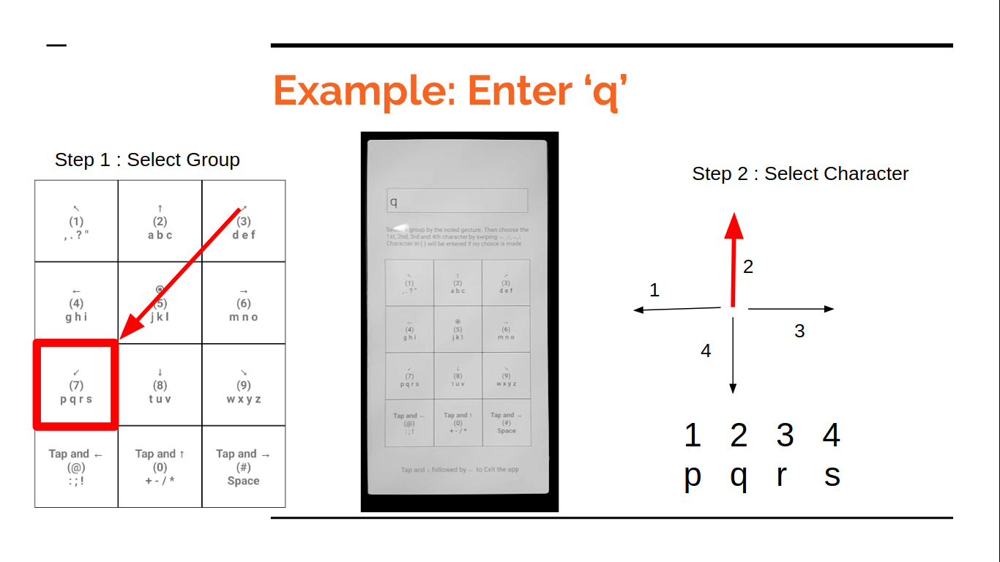

# VectorEntry - A Text Entry Mechanism for visually impaired

# Installation

Go to https://github.com/OrkoHunter/VectorEntry-Keyboard/releases and download the latest apk file. Install it in your android phone.

# Usage

All the numbers and the characters are divided into 4x3 = 12 groups, based on the T-9 mobile keypad layout.

VectorEntry is a two-step procedure to input one character.

# Step 1: Group Selection

| Alphabets | Group  | Flick direction/type  |
| --------- | ------ | --------------------- |
| [, . ? ”] | Key 1  | bottom to left ( ↖)   |
| [a b c]   | Key 2  | up ( ↑ )              |
| [d e f]   | Key 3  | bottom to right ( ↗ ) |
| [g h i]   | Key 4  | left ( ←)             |
| [j k l]   | Key 5  | long press ( ⦿ )      |
| [m n o]   | Key 6  | right ( → )           |
| [p q r s] | Key 7  | top to left ( ↙ )     |
| [t u v]   | Key 8  | down ( ↓ )            |
| [w x y z] | Key 9  | top to right ( ↘ )    |
| [: ; !]   | Key @  | Single Tap and Left   |
| [+ - / *] | Key 0  | Single Tap and Up     |
| [Space]   | Key #  | Single Tap and Right  |
| [Quit]    | NA     | Single Tap and Down   |
| backspace | NA     | Double Tap            |

Select the group by the gesture associated with it. If you want to enter a number, select the group of that Key.

# Step 2: Select a character from the group

The next gesture determines which character to choose from the selected group. The directions have the following meaning (clockwise directions) -

```
Left flick - First

Top flick - Second

Right flick - Third

Bottom flick - Fourth
```

A group can have maximum 4 possible characters. For example, the group of Key 9 has (1) `w`, (2) `x`, (3) `y` and (4) `z` possibilities. To select `y`, we will do the bottom flick.

If no second move is made within five seconds, then the number of that key is inserted. For example, if a person does `up` flick and leaves for five seconds, the number `2` is entered.

# Example

To select `q`, we first select the group of Key 7 by doing a bottom-left flick. We then do an `up` flick because `q` is the second character in the group.


